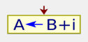
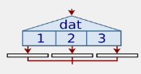

# Diagrmas de flujo en PSeint
|Simbolo|Descripción|
|:-:|-|
||Comentarios, no se ejecuta en el diagrma|
|| La instrucción __Escribir__ permite mostrar valores al ambiente.Puede utilizarse indistintamente las palabras __Imprimir__ y __Mostrar__ en lugar de __Escribir__. Además , en este caso se permite opcionalmente separar las expresiones a mostrar simplemente con espacios en lugar de comas|
||La instrucción Leer permite ingresar información desde el ambiente.La instrucción Leer permite ingresar información desde el ambiente.|
|| La instrucción de asignación permite almacenar una valor en una variable. La instrucción de asignación permite almacenar una valor en una variable|
||La secuencia de instrucciones ejecutadas por la instrucción Si-Entonces-SiNo depende del valor de una condición lógica. La condición debe ser una expresión lógica, que al ser evaluada retorna Verdadero o Falso.|
|| La secuencia de instrucciones ejecutada por una instrucción Segun depende del valor de una variable numérica. Opcionalmente, se puede agregar una opción final, denominada De Otro Modo, cuya secuencia de instrucciones asociada se ejecutará sólo si el valor almacenado en la variable no coincide con ninguna de las opciones anteriores.|
||La instrucción Mientras ejecuta una secuencia de instrucciones mientras una condición sea verdadera.Al ejecutarse esta instrucción, la condición es evaluada. Si la condición resulta verdadera, se ejecuta una vez la secuencia de instrucciones que forman el cuerpo del ciclo. Al finalizar la ejecución del cuerpo del ciclo se vuelve a evaluar la condición y, si es verdadera, la ejecución se repite. Estos pasos se repiten mientras la condición sea verdadera. |
||La instrucción Repetir-Hasta Que ejecuta una secuencia de instrucciones hasta que la condición sea verdadera.Al ejecutarse esta instrucción, la secuencia de instrucciones que forma el cuerpo del ciclo se ejecuta una vez y luego se evalúa la condición. Si la condición es falsa, el cuerpo del ciclo se ejecuta nuevamente y se vuelve a evaluar la condición. Esto se repite hasta que la condición sea verdadera. |
|| La instrucción Para ejecuta una secuencia de instrucciones un número determinado de veces.|

## Descargar e instalar PSeInt

1. Dirígete al sitio oficial de PSeInt: http://pseint.sourceforge.net/
2. Descarga la versión correspondiente a tu sistema operativo.
3. Ejecuta el archivo de instalación y sigue las instrucciones.

## Interfaz de usuario

Al abrir PSeInt, verás la pantalla principal con varias opciones, como:

- Nuevo: para crear un nuevo archivo.
- Abrir: para abrir un archivo existente.
- Guardar: para guardar un archivo.
- Compilar: para compilar el código.
- Ejecutar: para ejecutar el código.
- Depurar: para depurar el código.
- Ayuda: para acceder a la documentación y ayuda.

La pantalla principal también tiene dos secciones principales:

1. Editor de código: donde puedes escribir tu pseudocódigo.
2. Resultados: donde se muestran los resultados de la compilación y ejecución.

## Escribir pseudocódigo

Para escribir pseudocódigo en PSeInt, debes seguir algunas convenciones de sintaxis:

- Todas las líneas deben comenzar con una palabra clave en minúscula, como "inicio", "fin", "si", "sino", "mientras", "hacer", "para", etc.
- Los comentarios comienzan con "//" y se usan para agregar notas o explicaciones en el código.
- Las variables deben declararse antes de su uso.
- Las operaciones aritméticas se realizan con los símbolos +, -, *, /, %.
- Las operaciones lógicas se realizan con los símbolos && (y), || (o) y ! (negación).
- Las comparaciones se realizan con los símbolos <, >, <=, >=, == y !=.

## Compilar y ejecutar

Una vez que hayas escrito tu pseudocódigo, puedes compilarlo y ejecutarlo haciendo clic en los botones "Compilar" y "Ejecutar", respectivamente. Si hay errores en tu código, la compilación fallará y se mostrarán los errores en la sección de resultados.

## Depuración

Si necesitas depurar tu código para encontrar errores, puedes usar la opción "Depurar". Esta opción permite ejecutar tu código paso a paso y ver el valor de las variables en cada paso.